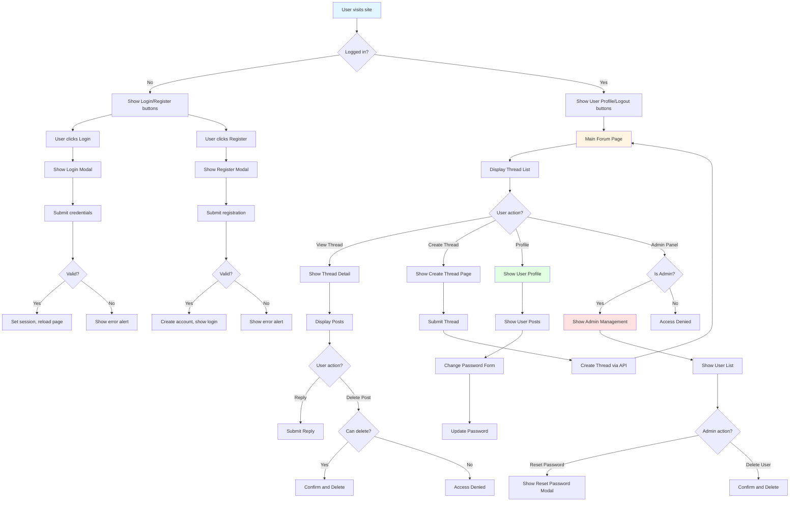

# PHP Forum Application

A full-stack forum application with PHP backend and TypeScript frontend.

## Project Structure

```
php_forum/
├── backend/           # PHP backend code
│   ├── api.php       # Main API endpoint
│   ├── config.php    # Configuration and utility functions
│   ├── index.php     # Frontend entry point
│   ├── init.php      # Initialization script
│   └── tests/        # PHP unit tests
├── frontend/         # TypeScript frontend code
│   ├── src/         # TypeScript source files
│   │   ├── main.ts  # Main entry point
│   │   ├── api.ts   # API client
│   │   ├── components.ts  # UI components
│   │   └── utils.ts # Utility functions
│   ├── dist/        # Compiled JavaScript (generated)
│   ├── tests/       # TypeScript unit tests
│   └── tsconfig.json # TypeScript configuration
├── data/            # Data storage directory
│   ├── credentials.json  # User credentials (auto-generated)
│   └── threads.json      # Forum threads (auto-generated)
└── README.md        # This file
```

## Features

- **User Authentication**: Registration, login, and logout
- **Thread Management**: Create threads and reply to posts
- **User Profiles**: Users can view and delete their own posts, change passwords
- **Administrator Panel**: Admins can manage users, reset passwords, and delete posts
- **Secure Password Storage**: Passwords are hashed using PHP's `password_hash()` function
- **Session Management**: HTTP-only cookies for secure session handling
- **Modern UI**: Bootstrap 5 styling with responsive design
- **No Browser Dialogs**: All interactions use Bootstrap modals and alerts

## Technology Stack

### Backend
- PHP 7.4+ with sessions
- JSON file-based storage
- RESTful API design

### Frontend
- TypeScript (compiled to ES5)
- Bootstrap 5 for UI
- AMD module system
- No external dependencies (except Bootstrap CDN)

## Installation

1. **Clone or download the project**

2. **Initialize the admin account**:
   ```bash
   php backend/init.php
   ```
   This creates the `data/credentials.json` file with an admin account:
   - Username: `admin`
   - Password: `admin123`

3. **Compile TypeScript**:
   ```bash
   cd frontend
   tsc
   ```

4. **Set up web server**:
   - Point your web server document root to the `backend/` directory
   - Ensure PHP is enabled
   - Make sure the `data/` directory is writable by the web server

## Configuration

### TypeScript Configuration

The `tsconfig.json` is configured with:
- **target**: ES5 (for maximum browser compatibility)
- **module**: AMD (to avoid CommonJS issues)
- **lib**: ["ES5", "DOM", "ES2015.Promise"] (for Promise support)
- **inlineSourceMap**: true (for debugging)
- **inlineSources**: true (for debugging)

### PHP Configuration

- Sessions use HTTP-only cookies for security
- Output buffering is enabled to prevent "headers already sent" warnings
- All passwords are hashed using `PASSWORD_DEFAULT` algorithm

## API Endpoints

All API requests are POST requests to `api.php` with an `action` parameter.

### Authentication
- `login`: Login with username and password
- `logout`: Logout current user
- `register`: Register a new user account
- `getCurrentUser`: Get current user information

### Threads
- `getThreads`: Get all forum threads
- `createThread`: Create a new thread (requires login)
- `createPost`: Reply to a thread (requires login)
- `deletePost`: Delete a post (requires login, admin or post author)

### User Management (Admin only)
- `getUsers`: Get all users
- `deleteUser`: Delete a user account
- `updatePassword`: Update user password (admin can reset any password)

## Data Storage

### credentials.json
Stores user credentials in the following format:
```json
{
    "username": {
        "password": "hashed_password",
        "isAdmin": true/false,
        "createdAt": unix_timestamp
    }
}
```

### threads.json
Stores forum threads in the following format:
```json
[
    {
        "id": 1,
        "title": "Thread Title",
        "author": "username",
        "createdAt": unix_timestamp,
        "posts": [
            {
                "id": 1,
                "author": "username",
                "content": "Post content",
                "createdAt": unix_timestamp
            }
        ]
    }
]
```

All timestamps are stored as Unix timestamps (seconds since epoch).

## Testing

### PHP Tests
Run PHP unit tests:
```bash
php backend/tests/ApiTest.php
```

### TypeScript Tests
TypeScript tests are included in the `frontend/tests/` directory. They can be run in a Node.js environment or browser.

## Security Features

1. **Password Hashing**: All passwords are hashed using PHP's `password_hash()` with the default algorithm (bcrypt)
2. **HTTP-Only Cookies**: Session cookies are HTTP-only to prevent XSS attacks
3. **Input Validation**: All user inputs are validated on both client and server side
4. **XSS Protection**: HTML is escaped when displaying user content
5. **Authorization Checks**: All sensitive operations check user permissions

## Application Flow



## Deployment

### Requirements
- PHP 7.4 or higher
- Web server (Apache, Nginx, or PHP built-in server)
- Write permissions on the `data/` directory

### Deployment Steps

1. **Upload files** to your web server
2. **Set permissions**:
   ```bash
   chmod 755 backend/
   chmod 755 frontend/
   chmod 777 data/  # Or set appropriate ownership
   ```
3. **Initialize admin account**:
   ```bash
   php backend/init.php
   ```
4. **Compile TypeScript**:
   ```bash
   cd frontend
   tsc
   ```
5. **Configure web server** to point to `backend/` directory
6. **Access the application** via your web server URL

### Using PHP Built-in Server (Development)

```bash
cd backend
php -S localhost:8000 router.php
```

Then access `http://localhost:8000` in your browser.

**Note**: The `router.php` script is required to properly route requests to both backend and frontend files when using PHP's built-in server.

### Apache Configuration

If using Apache, create a `.htaccess` file in the `backend/` directory:

```apache
RewriteEngine On
RewriteCond %{REQUEST_FILENAME} !-f
RewriteCond %{REQUEST_FILENAME} !-d
RewriteRule ^(.*)$ index.php [QSA,L]
```

### Nginx Configuration

```nginx
server {
    listen 80;
    server_name your-domain.com;
    root /path/to/php_forum/backend;
    index index.php;

    location / {
        try_files $uri $uri/ /index.php?$query_string;
    }

    location ~ \.php$ {
        fastcgi_pass unix:/var/run/php/php7.4-fpm.sock;
        fastcgi_index index.php;
        include fastcgi_params;
        fastcgi_param SCRIPT_FILENAME $document_root$fastcgi_script_name;
    }
}
```

## Development

### Building TypeScript

```bash
cd frontend
tsc
```

The compiled files will be in `frontend/dist/`.

### File Headers

All source files include Doxygen-style file headers with:
- File description
- Creation date in RFC 3339 format (for file headers only)
- Author information

### Code Documentation

All functions are documented with Doxygen-style comments including:
- Brief description
- Detailed description
- Parameter documentation
- Return value documentation

## Troubleshooting

### "Headers already sent" warning
- This is prevented by `ob_start()` in `config.php`
- If you still see this, check for any output before PHP code

### Session not working
- Ensure `data/` directory is writable
- Check PHP session configuration
- Verify cookies are enabled in browser

### TypeScript compilation errors
- Ensure TypeScript is installed: `npm install -g typescript`
- Check `tsconfig.json` configuration
- Verify all dependencies are available

### API requests failing
- Check browser console for errors
- Verify API path is correct (`../backend/api.php`)
- Ensure PHP is running and accessible
- Check file permissions on `data/` directory

## License

This project is provided as-is for educational purposes.

## Author

Victor Yeh - Created 2025-12-18

